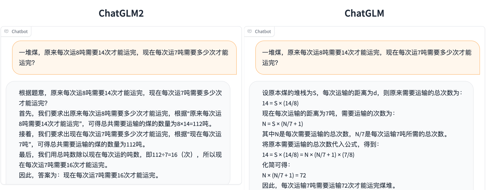
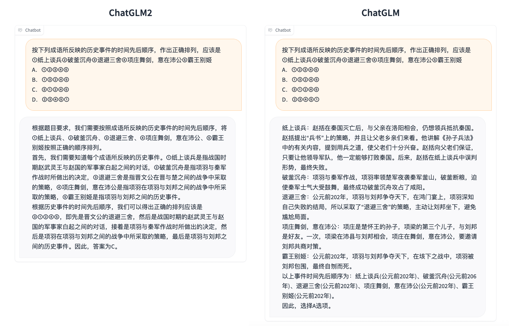
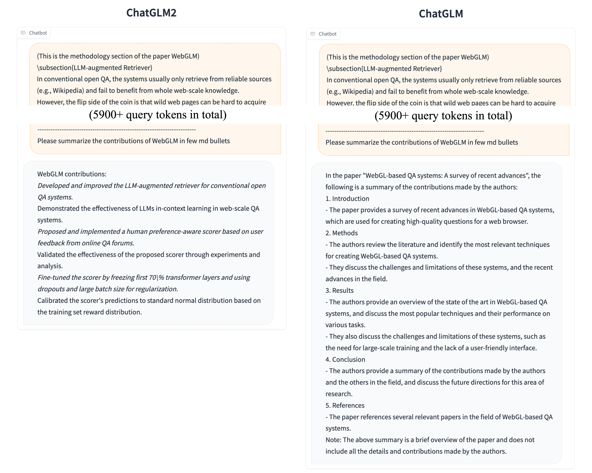
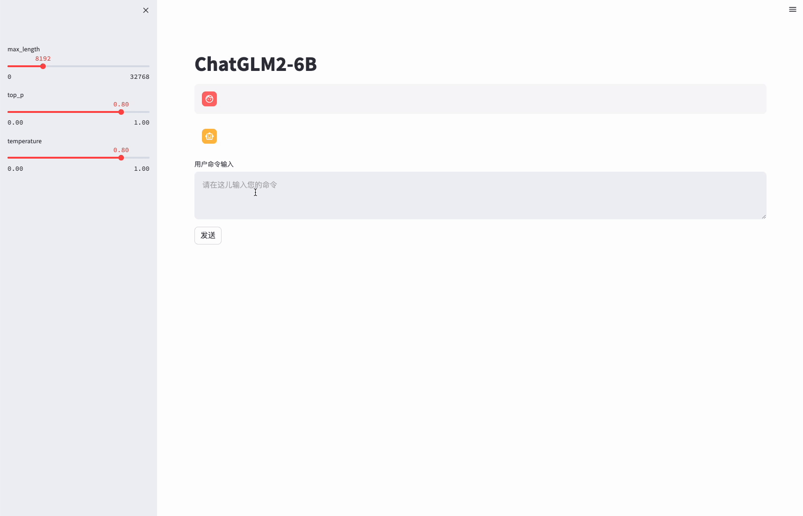

# ChatGLM2-6B

<p align="center">
🤗 <a href="https://huggingface.co/THUDM/chatglm2-6b" target="_blank">HF Repo</a> • 🐦 <a href="https://twitter.com/thukeg" target="_blank">Twitter</a> • 📃 <a href="https://arxiv.org/abs/2103.10360" target="_blank">[GLM@ACL 22]</a> <a href="https://github.com/THUDM/GLM" target="_blank">[GitHub]</a> • 📃 <a href="https://arxiv.org/abs/2210.02414" target="_blank">[GLM-130B@ICLR 23]</a> <a href="https://github.com/THUDM/GLM-130B" target="_blank">[GitHub]</a> <br>
</p>
<p align="center">
    👋 加入我们的 <a href="https://join.slack.com/t/chatglm/shared_invite/zt-1y7pqoloy-9b1g6T6JjA8J0KxvUjbwJw" target="_blank">Slack</a> 和 <a href="resources/WECHAT.md" target="_blank">WeChat</a>
</p>

*Read this in [English](README_EN.md)*

## 介绍

ChatGLM**2**-6B 是开源中英双语对话模型 [ChatGLM-6B](https://github.com/THUDM/ChatGLM-6B) 的第二代版本，在保留了初代模型对话流畅、部署门槛较低等众多优秀特性的基础之上，ChatGLM**2**-6B 引入了如下新特性：

1. **更强大的性能**：基于 ChatGLM 初代模型的开发经验，我们全面升级了 ChatGLM2-6B 的基座模型。ChatGLM2-6B 使用了 [GLM](https://github.com/THUDM/GLM) 的混合目标函数，经过了 1.4T 中英标识符的预训练与人类偏好对齐训练，[评测结果](#评测结果)显示，相比于初代模型，ChatGLM2-6B 在 MMLU（+23%）、CEval（+33%）、GSM8K（+571%） 、BBH（+60%）等数据集上的性能取得了大幅度的提升，在同尺寸开源模型中具有较强的竞争力。
2. **更长的上下文**：基于 [FlashAttention](https://github.com/HazyResearch/flash-attention) 技术，我们将基座模型的上下文长度（Context Length）由 ChatGLM-6B 的 2K 扩展到了 32K，并在对话阶段使用 8K 的上下文长度训练。对于更长的上下文，我们发布了 [ChatGLM2-6B-32K](https://huggingface.co/THUDM/chatglm2-6b-32k) 模型。[LongBench](https://github.com/THUDM/LongBench) 的测评结果表明，在等量级的开源模型中，ChatGLM2-6B-32K 有着较为明显的竞争优势。
3. **更高效的推理**：基于 [Multi-Query Attention](http://arxiv.org/abs/1911.02150) 技术，ChatGLM2-6B 有更高效的推理速度和更低的显存占用：在官方的模型实现下，推理速度相比初代提升了 42%，INT4 量化下，6G 显存支持的对话长度由 1K 提升到了 8K。
4. **更开放的协议**：ChatGLM2-6B 权重对学术研究**完全开放**，在填写[问卷](https://open.bigmodel.cn/mla/form)进行登记后**亦允许免费商业使用**。

欢迎通过 [chatglm.cn](https://chatglm.cn) 体验更大规模的 ChatGLM 模型。

-----

ChatGLM2-6B 开源模型旨在与开源社区一起推动大模型技术发展，恳请开发者和大家遵守[开源协议](MODEL_LICENSE)，勿将开源模型和代码及基于开源项目产生的衍生物用于任何可能给国家和社会带来危害的用途以及用于任何未经过安全评估和备案的服务。**目前，本项目团队未基于 ChatGLM2-6B 开发任何应用，包括网页端、安卓、苹果 iOS 及 Windows App 等应用。**

尽管模型在训练的各个阶段都尽力确保数据的合规性和准确性，但由于 ChatGLM2-6B 模型规模较小，且模型受概率随机性因素影响，无法保证输出内容的准确性，且模型易被误导。**本项目不承担开源模型和代码导致的数据安全、舆情风险或发生任何模型被误导、滥用、传播、不当利用而产生的风险和责任。**

## 更新信息
**[2023/07/31]** 发布 [ChatGLM2-6B-32K](https://huggingface.co/THUDM/chatglm2-6b-32k) 模型，提升对于长文本的理解能力。

**[2023/07/25]** 发布 [CodeGeeX2](https://github.com/THUDM/CodeGeeX2) 模型，基于 ChatGLM2-6B 加入代码预训练实现，代码能力全面提升。

**[2023/07/04]** 发布 P-Tuning v2 与 全参数微调脚本，参见 [P-Tuning](./ptuning)。

## 友情链接
对 ChatGLM2 进行加速的开源项目：
* [fastllm](https://github.com/ztxz16/fastllm/): 全平台加速推理方案，单GPU批量推理每秒可达10000+token，手机端最低3G内存实时运行（骁龙865上约4~5 token/s）
* [chatglm.cpp](https://github.com/li-plus/chatglm.cpp): 类似 llama.cpp 的 CPU 量化加速推理方案，实现 Mac 笔记本上实时对话
* [ChatGLM2-TPU](https://github.com/sophgo/ChatGLM2-TPU): 采用TPU加速推理方案，在算能端侧芯片BM1684X（16T@FP16，内存16G）上实时运行约3 token/s

支持 ChatGLM-6B 和相关应用在线训练的示例项目：
* [ChatGLM2-6B 的部署与微调教程](https://www.heywhale.com/mw/project/64984a7b72ebe240516ae79c)

## 评测结果
我们选取了部分中英文典型数据集进行了评测，以下为 ChatGLM2-6B 模型在 [MMLU](https://github.com/hendrycks/test) (英文)、[C-Eval](https://cevalbenchmark.com/static/leaderboard.html)（中文）、[GSM8K](https://github.com/openai/grade-school-math)（数学）、[BBH](https://github.com/suzgunmirac/BIG-Bench-Hard)（英文） 上的测评结果。在 [evaluation](./evaluation/README.md) 中提供了在 C-Eval 上进行测评的脚本。

### MMLU

| Model | Average | STEM | Social Sciences | Humanities | Others |
| ----- |------| ---- |------|-------| ----- |
| ChatGLM-6B | 40.63 | 33.89 | 44.84 | 39.02 | 45.71 |
| ChatGLM2-6B (base) | 47.86 | 41.20 | 54.44 | 43.66 | 54.46 |
| ChatGLM2-6B | 45.46 | 40.06 | 51.61 | 41.23 | 51.24 |
| ChatGLM2-12B (base) | 56.18 | 48.18 | 65.13 | 52.58 | 60.93 |
| ChatGLM2-12B | 52.13 | 47.00 | 61.00 | 46.10 | 56.05 |

> Chat 模型使用 zero-shot CoT (Chain-of-Thought) 的方法测试，Base 模型使用 few-shot answer-only 的方法测试

### C-Eval

| Model | Average | STEM  | Social Sciences | Humanities | Others |
| ----- |---------|-------| ----- |------------|--------|
| ChatGLM-6B | 38.9    | 33.3  | 48.3 | 41.3       | 38.0   |
| ChatGLM2-6B (base) | 51.7    | 48.6  | 60.5 | 51.3       | 49.8   |
| ChatGLM2-6B | 50.1    | 46.4	 | 60.4 | 50.6       | 46.9   |
| ChatGLM2-12B (base) | 61.6    | 55.4	 | 73.7 | 64.2       | 59.4   | 
| ChatGLM2-12B | 57.0    | 52.1	 | 69.3 | 58.5       | 53.2   | 

> Chat 模型使用 zero-shot CoT 的方法测试，Base 模型使用 few-shot answer only 的方法测试

### GSM8K

| Model        | Accuracy | Accuracy (Chinese)* |
|--------------|----------| - |
| ChatGLM-6B   | 4.82     | 5.85 |
| ChatGLM2-6B (base) | 32.37    | 28.95 |
| ChatGLM2-6B  | 28.05    | 20.45 |
| ChatGLM2-12B (base) | 40.94    | 42.71 |
| ChatGLM2-12B | 38.13    | 23.43 |

> 所有模型均使用 few-shot CoT 的方法测试，CoT prompt 来自 http://arxiv.org/abs/2201.11903
> 
> \* 我们使用翻译 API 翻译了 GSM8K 中的 500 道题目和 CoT prompt 并进行了人工校对


### BBH

| Model        | Accuracy |
|--------------|-------|
| ChatGLM-6B   | 18.73 |
| ChatGLM2-6B (base) | 33.68 |
| ChatGLM2-6B  | 30.00 |
| ChatGLM2-12B (base) | 36.02 |
| ChatGLM2-12B | 39.98 |

> 所有模型均使用 few-shot CoT 的方法测试，CoT prompt 来自 https://github.com/suzgunmirac/BIG-Bench-Hard/tree/main/cot-prompts

## 推理性能
ChatGLM2-6B 使用了 [Multi-Query Attention](http://arxiv.org/abs/1911.02150)，提高了生成速度。生成 2000 个字符的平均速度对比如下

| Model | 推理速度 (字符/秒) |
| ----  | -----  |
| ChatGLM-6B  | 31.49 |
| ChatGLM2-6B | 44.62 |

> 使用官方实现，batch size = 1，max length = 2048，bf16 精度，测试硬件为 A100-SXM4-80G，软件环境为 PyTorch 2.0.1

Multi-Query Attention 同时也降低了生成过程中 KV Cache 的显存占用，此外，ChatGLM2-6B 采用 Causal Mask 进行对话训练，连续对话时可复用前面轮次的 KV Cache，进一步优化了显存占用。因此，使用 6GB 显存的显卡进行 INT4 量化的推理时，初代的 ChatGLM-6B 模型最多能够生成 1119 个字符就会提示显存耗尽，而 ChatGLM2-6B 能够生成至少 8192 个字符。

| **量化等级** | **编码 2048 长度的最小显存** | **生成 8192 长度的最小显存** |
| -------------- |---------------------|---------------------|
| FP16 / BF16 | 13.1 GB             | 12.8 GB             | 
| INT8           | 8.2 GB              | 8.1 GB              |
| INT4           | 5.5 GB              | 5.1 GB              |

> ChatGLM2-6B 利用了 PyTorch 2.0 引入的 `torch.nn.functional.scaled_dot_product_attention` 实现高效的 Attention 计算，如果 PyTorch 版本较低则会 fallback 到朴素的 Attention 实现，出现显存占用高于上表的情况。

我们也测试了量化对模型性能的影响。结果表明，量化对模型性能的影响在可接受范围内。

| 量化等级 | Accuracy (MMLU) | Accuracy (C-Eval dev) |
| ----- | ----- |-----------------------|
| BF16 | 45.47 | 53.57                 |
| INT4 | 43.13 | 50.30                 |


## ChatGLM2-6B 示例

相比于初代模型，ChatGLM2-6B 多个维度的能力都取得了提升，以下是一些对比示例。更多 ChatGLM2-6B 的可能，等待你来探索发现！

<details><summary><b>数理逻辑</b></summary>



</details>

<details><summary><b>知识推理</b></summary>



</details>

<details><summary><b>长文档理解</b></summary>



</details>

## 使用方式
### 环境安装
首先需要下载本仓库：
```shell
git clone https://github.com/THUDM/ChatGLM2-6B
cd ChatGLM2-6B
```

然后使用 pip 安装依赖：
```
pip install -r requirements.txt
```
其中 `transformers` 库版本推荐为 `4.30.2`，`torch` 推荐使用 2.0 及以上的版本，以获得最佳的推理性能。

### 代码调用 

可以通过如下代码调用 ChatGLM2-6B 模型来生成对话：

```python
>>> from transformers import AutoTokenizer, AutoModel
>>> tokenizer = AutoTokenizer.from_pretrained("THUDM/chatglm2-6b", trust_remote_code=True)
>>> model = AutoModel.from_pretrained("THUDM/chatglm2-6b", trust_remote_code=True, device='cuda')
>>> model = model.eval()
>>> response, history = model.chat(tokenizer, "你好", history=[])
>>> print(response)
你好👋!我是人工智能助手 ChatGLM2-6B,很高兴见到你,欢迎问我任何问题。
>>> response, history = model.chat(tokenizer, "晚上睡不着应该怎么办", history=history)
>>> print(response)
晚上睡不着可能会让你感到焦虑或不舒服,但以下是一些可以帮助你入睡的方法:

1. 制定规律的睡眠时间表:保持规律的睡眠时间表可以帮助你建立健康的睡眠习惯,使你更容易入睡。尽量在每天的相同时间上床,并在同一时间起床。
2. 创造一个舒适的睡眠环境:确保睡眠环境舒适,安静,黑暗且温度适宜。可以使用舒适的床上用品,并保持房间通风。
3. 放松身心:在睡前做些放松的活动,例如泡个热水澡,听些轻柔的音乐,阅读一些有趣的书籍等,有助于缓解紧张和焦虑,使你更容易入睡。
4. 避免饮用含有咖啡因的饮料:咖啡因是一种刺激性物质,会影响你的睡眠质量。尽量避免在睡前饮用含有咖啡因的饮料,例如咖啡,茶和可乐。
5. 避免在床上做与睡眠无关的事情:在床上做些与睡眠无关的事情,例如看电影,玩游戏或工作等,可能会干扰你的睡眠。
6. 尝试呼吸技巧:深呼吸是一种放松技巧,可以帮助你缓解紧张和焦虑,使你更容易入睡。试着慢慢吸气,保持几秒钟,然后缓慢呼气。

如果这些方法无法帮助你入睡,你可以考虑咨询医生或睡眠专家,寻求进一步的建议。
```

#### 从本地加载模型
以上代码会由 `transformers` 自动下载模型实现和参数。完整的模型实现在 [Hugging Face Hub](https://huggingface.co/THUDM/chatglm2-6b)。如果你的网络环境较差，下载模型参数可能会花费较长时间甚至失败。此时可以先将模型下载到本地，然后从本地加载。

从 Hugging Face Hub 下载模型需要先[安装Git LFS](https://docs.github.com/zh/repositories/working-with-files/managing-large-files/installing-git-large-file-storage)，然后运行
```Shell
git clone https://huggingface.co/THUDM/chatglm2-6b
```

如果你从 Hugging Face Hub 上下载 checkpoint 的速度较慢，可以只下载模型实现
```Shell
GIT_LFS_SKIP_SMUDGE=1 git clone https://huggingface.co/THUDM/chatglm2-6b
```
然后从[这里](https://cloud.tsinghua.edu.cn/d/674208019e314311ab5c/)手动下载模型参数文件，并将下载的文件替换到本地的 `chatglm2-6b` 目录下。


将模型下载到本地之后，将以上代码中的 `THUDM/chatglm2-6b` 替换为你本地的 `chatglm2-6b` 文件夹的路径，即可从本地加载模型。

模型的实现仍然处在变动中。如果希望固定使用的模型实现以保证兼容性，可以在 `from_pretrained` 的调用中增加 `revision="v1.0"` 参数。`v1.0` 是当前最新的版本号，完整的版本列表参见 [Change Log](https://huggingface.co/THUDM/chatglm2-6b#change-log)。

### 网页版 Demo

可以通过以下命令启动基于 Gradio 的网页版 demo：
```shell
python web_demo.py
```



可以通过以下命令启动基于 Streamlit 的网页版 demo：
```shell
streamlit run web_demo2.py
```

网页版 demo 会运行一个 Web Server，并输出地址。在浏览器中打开输出的地址即可使用。 经测试，基于 Streamlit 的网页版 Demo 会更流畅。

### 命令行 Demo


运行仓库中 [cli_demo.py](cli_demo.py)：

```shell
python cli_demo.py
```

程序会在命令行中进行交互式的对话，在命令行中输入指示并回车即可生成回复，输入 `clear` 可以清空对话历史，输入 `stop` 终止程序。

### API 部署
首先需要安装额外的依赖 `pip install fastapi uvicorn`，然后运行仓库中的 [api.py](api.py)：
```shell
python api.py
```
默认部署在本地的 8000 端口，通过 POST 方法进行调用
```shell
curl -X POST "http://127.0.0.1:8000" \
     -H 'Content-Type: application/json' \
     -d '{"prompt": "你好", "history": []}'
```
得到的返回值为
```shell
{
  "response":"你好👋！我是人工智能助手 ChatGLM2-6B，很高兴见到你，欢迎问我任何问题。",
  "history":[["你好","你好👋！我是人工智能助手 ChatGLM2-6B，很高兴见到你，欢迎问我任何问题。"]],
  "status":200,
  "time":"2023-03-23 21:38:40"
}
```
感谢 [@hiyouga]() 实现了 OpenAI 格式的流式 API 部署，可以作为任意基于 ChatGPT 的应用的后端，比如 [ChatGPT-Next-Web](https://github.com/Yidadaa/ChatGPT-Next-Web)。可以通过运行仓库中的[openai_api.py](openai_api.py) 进行部署：
```shell
python openai_api.py
```
进行 API 调用的示例代码为
```python
import openai
if __name__ == "__main__":
    openai.api_base = "http://localhost:8000/v1"
    openai.api_key = "none"
    for chunk in openai.ChatCompletion.create(
        model="chatglm2-6b",
        messages=[
            {"role": "user", "content": "你好"}
        ],
        stream=True
    ):
        if hasattr(chunk.choices[0].delta, "content"):
            print(chunk.choices[0].delta.content, end="", flush=True)
```


## 低成本部署

### 模型量化

默认情况下，模型以 FP16 精度加载，运行上述代码需要大概 13GB 显存。如果你的 GPU 显存有限，可以尝试以量化方式加载模型，使用方法如下：

```python
model = AutoModel.from_pretrained("THUDM/chatglm2-6b-int4",trust_remote_code=True).cuda()
```

模型量化会带来一定的性能损失，经过测试，ChatGLM2-6B 在 4-bit 量化下仍然能够进行自然流畅的生成。 量化模型的参数文件也可以从[这里](https://cloud.tsinghua.edu.cn/d/674208019e314311ab5c/)手动下载。

### CPU 部署

如果你没有 GPU 硬件的话，也可以在 CPU 上进行推理，但是推理速度会更慢。使用方法如下（需要大概 32GB 内存）
```python
model = AutoModel.from_pretrained("THUDM/chatglm2-6b", trust_remote_code=True).float()
```
如果你的内存不足的话，也可以使用量化后的模型
```python
model = AutoModel.from_pretrained("THUDM/chatglm2-6b-int4",trust_remote_code=True).float()
```
在 cpu 上运行量化后的模型需要安装 `gcc` 与 `openmp`。多数 Linux 发行版默认已安装。对于 Windows ，可在安装 [TDM-GCC](https://jmeubank.github.io/tdm-gcc/) 时勾选 `openmp`。 Windows 测试环境 `gcc` 版本为 `TDM-GCC 10.3.0`， Linux 为 `gcc 11.3.0`。在 MacOS 上请参考 [Q1](FAQ.md#q1)。

### Mac 部署

对于搭载了 Apple Silicon 或者 AMD GPU 的 Mac，可以使用 MPS 后端来在 GPU 上运行 ChatGLM2-6B。需要参考 Apple 的 [官方说明](https://developer.apple.com/metal/pytorch) 安装 PyTorch-Nightly（正确的版本号应该是2.x.x.dev2023xxxx，而不是 2.x.x）。

目前在 MacOS 上只支持[从本地加载模型](README.md#从本地加载模型)。将代码中的模型加载改为从本地加载，并使用 mps 后端：
```python
model = AutoModel.from_pretrained("your local path", trust_remote_code=True).to('mps')
```

加载半精度的 ChatGLM2-6B 模型需要大概 13GB 内存。内存较小的机器（比如 16GB 内存的 MacBook Pro），在空余内存不足的情况下会使用硬盘上的虚拟内存，导致推理速度严重变慢。
此时可以使用量化后的模型 chatglm2-6b-int4。因为 GPU 上量化的 kernel 是使用 CUDA 编写的，因此无法在 MacOS 上使用，只能使用 CPU 进行推理。
为了充分使用 CPU 并行，还需要[单独安装 OpenMP](FAQ.md#q1)。

在 Mac 上进行推理也可以使用 [ChatGLM.cpp](https://github.com/li-plus/chatglm.cpp)

### 多卡部署
如果你有多张 GPU，但是每张 GPU 的显存大小都不足以容纳完整的模型，那么可以将模型切分在多张GPU上。首先安装 accelerate: `pip install accelerate`，然后通过如下方法加载模型：
```python
from utils import load_model_on_gpus
model = load_model_on_gpus("THUDM/chatglm2-6b", num_gpus=2)
```
即可将模型部署到两张 GPU 上进行推理。你可以将 `num_gpus` 改为你希望使用的 GPU 数。默认是均匀切分的，你也可以传入 `device_map` 参数来自己指定。 

## 协议

本仓库的代码依照 [Apache-2.0](https://www.apache.org/licenses/LICENSE-2.0) 协议开源，ChatGLM2-6B 模型的权重的使用则需要遵循 [Model License](MODEL_LICENSE)。ChatGLM2-6B 权重对学术研究**完全开放**，在填写[问卷](https://open.bigmodel.cn/mla/form)进行登记后**亦允许免费商业使用**。


## 引用

如果你觉得我们的工作有帮助的话，请考虑引用下列论文，ChatGLM2-6B 的论文会在近期公布，敬请期待～

```
@article{zeng2022glm,
  title={Glm-130b: An open bilingual pre-trained model},
  author={Zeng, Aohan and Liu, Xiao and Du, Zhengxiao and Wang, Zihan and Lai, Hanyu and Ding, Ming and Yang, Zhuoyi and Xu, Yifan and Zheng, Wendi and Xia, Xiao and others},
  journal={arXiv preprint arXiv:2210.02414},
  year={2022}
}
```
```
@inproceedings{du2022glm,
  title={GLM: General Language Model Pretraining with Autoregressive Blank Infilling},
  author={Du, Zhengxiao and Qian, Yujie and Liu, Xiao and Ding, Ming and Qiu, Jiezhong and Yang, Zhilin and Tang, Jie},
  booktitle={Proceedings of the 60th Annual Meeting of the Association for Computational Linguistics (Volume 1: Long Papers)},
  pages={320--335},
  year={2022}
}
```
