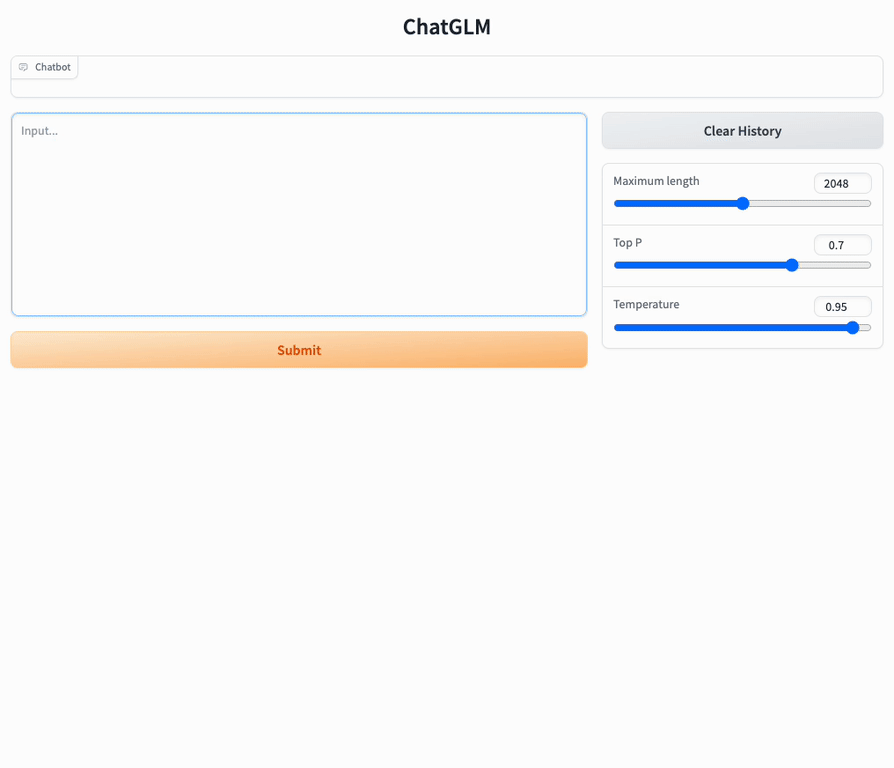

<p align="center">
🤗 <a href="https://huggingface.co/THUDM/chatglm2-6b" target="_blank">HF Repo</a> • 🐦 <a href="https://twitter.com/thukeg" target="_blank">Twitter</a> • 📃 <a href="https://arxiv.org/abs/2103.10360" target="_blank">[GLM@ACL 22]</a> <a href="https://github.com/THUDM/GLM" target="_blank">[GitHub]</a> • 📃 <a href="https://arxiv.org/abs/2210.02414" target="_blank">[GLM-130B@ICLR 23]</a> <a href="https://github.com/THUDM/GLM-130B" target="_blank">[GitHub]</a> <br>
</p>
<p align="center">
    👋 Join our <a href="https://join.slack.com/t/chatglm/shared_invite/zt-1y7pqoloy-9b1g6T6JjA8J0KxvUjbwJw" target="_blank">Slack</a> and <a href="resources/WECHAT.md" target="_blank">WeChat</a>
</p>

## Introduction

ChatGLM**2**-6B is the second-generation version of the open-source bilingual (Chinese-English) chat model [ChatGLM-6B](https://github.com/THUDM/ChatGLM-6B). It retains the smooth conversation flow and low deployment threshold of the first-generation model, while introducing the following new features:

1. **Stronger Performance**: Based on the development experience of the first-generation ChatGLM model, we have fully upgraded the base model of ChatGLM2-6B. ChatGLM2-6B uses the hybrid objective function of [GLM](https://github.com/THUDM/GLM), and has undergone pre-training with 1.4T bilingual tokens and human preference alignment training. The [evaluation results](README.md#evaluation-results) show that, compared to the first-generation model, ChatGLM2-6B has achieved substantial improvements in performance on datasets like MMLU (+23%), CEval (+33%), GSM8K (+571%), BBH (+60%), showing strong competitiveness among models of the same size.
2. **Longer Context**: Based on [FlashAttention](https://github.com/HazyResearch/flash-attention) technique, we have extended the context length of the base model from 2K in ChatGLM-6B to 32K, and trained with a context length of 8K during the dialogue alignment, allowing for more rounds of dialogue. However, the current version of ChatGLM2-6B has limited understanding of single-round ultra-long documents, which we will focus on optimizing in future iterations.
3. **More Efficient Inference**: Based on [Multi-Query Attention](http://arxiv.org/abs/1911.02150) technique, ChatGLM2-6B has more efficient inference speed and lower GPU memory usage: under the official  implementation, the inference speed has increased by 42% compared to the first generation; under INT4 quantization, the dialogue length supported by 6G GPU memory has increased from 1K to 8K.
4. **More Open License**: ChatGLM2-6B weights are **completely open** for academic research, and **free commercial use** is also allowed after completing the [questionnaire](https://lslfd0slxc.feishu.cn/share/base/form/shrcnfAj1ZnGOW7kqAfiHFcAFXc).

Welcome to use the larger ChatGLM model on [chatglm.cn](https://chatglm.cn) 

-----

The open-source ChatGLM2-6B is intended to promote the development of LLMs together with the open-source community. We earnestly request developers and everyone to abide by the [open-source license](MODEL_LICENSE). Do not use the open-source model, code, or any derivatives from the open-source project for any purposes that may harm nations or societies, or for any services that have not undergone safety assessments and legal approval. **At present, our project team has not developed any applications based on ChatGLM2-6B, including web, Android, Apple iOS, and Windows App applications.**

Although the model strives to ensure the compliance and accuracy of data at each stage of training, due to the smaller scale of the ChatGLM2-6B model, and its susceptibility to probabilistic randomness, the accuracy of output content cannot be guaranteed, and the model can easily be misled. **Our project does not assume any risks or responsibilities arising from data security, public opinion risks, or any instances of the model being misled, abused, disseminated, or improperly used due to the open-source model and code.**

## Projects
Open source projects that accelerate ChatGLM2:

* [fastllm](https://github.com/ztxz16/fastllm/): Universal platform acceleration inference solution, single GPU batch inference can reach 10,000+ tokens per second, and it can run in real-time on mobile devices with a minimum of 3GB of memory (about 4~5 tokens/s on Snapdragon 865).
* [chatglm.cpp](https://github.com/li-plus/chatglm.cpp): Real-time CPU inference on a MacBook accelerated by quantization, similar to llama.cpp.
* [ChatGLM2-TPU](https://github.com/sophgo/ChatGLM2-TPU): Using the TPU accelerated inference solution, it runs about 3 token/s in real time on the end-side chip BM1684X (16T@FP16, 16G DDR).

Example projects supporting online training of ChatGLM-6B and related applications:
* [ChatGLM-6B deployment and fine-tuning tutorial](https://www.heywhale.com/mw/project/64984a7b72ebe240516ae79c)

## Evaluation
We selected some typical Chinese and English datasets for evaluation. Below are the evaluation results of the ChatGLM2-6B model on [MMLU](https://github.com/hendrycks/test) (English), [C-Eval](https://cevalbenchmark.com/static/leaderboard.html) (Chinese), [GSM8K](https://github.com/openai/grade-school-math) (Mathematics), [BBH](https://github.com/suzgunmirac/BIG-Bench-Hard) (English).

### MMLU

| Model | Average | STEM | Social Sciences | Humanities | Others |
| ----- | ----- | ---- | ----- | ----- | ----- |
| ChatGLM-6B | 40.63 | 33.89 | 44.84 | 39.02 | 45.71 |
| ChatGLM2-6B (base) | 47.86 | 41.20 | 54.44 | 43.66 | 54.46 |
| ChatGLM2-6B | 45.46 | 40.06 | 51.61 | 41.23 | 51.24 |

> Chat-aligned version is evaluated under zero-shot CoT (Chain-of-Thought), and Base version is evaluated under few-shot answer-only

### C-Eval

| Model | Average | STEM | Social Sciences | Humanities | Others |
| ----- | ---- | ---- | ----- | ----- | ----- |
| ChatGLM-6B | 38.9 | 33.3 | 48.3 | 41.3 | 38.0 |
| ChatGLM2-6B (base) | 51.7 | 48.6 | 60.5 | 51.3 | 49.8 |
| ChatGLM2-6B | 50.1 | 46.4	| 60.4 | 50.6 | 46.9 | 

> Chat-aligned version is evaluated under zero-shot CoT (Chain-of-Thought), and Base version is evaluated under few-shot answer-only

### GSM8K

| Model | Accuracy | Accuracy (Chinese)* |
| ----- | ----- | ----- |
| ChatGLM-6B | 4.82 | 5.85 |
| ChatGLM2-6B (base) | 32.37 | 28.95 |
| ChatGLM2-6B | 28.05 | 20.45 |

> All model versions are evaluated under few-shot CoT, and CoT prompts are from http://arxiv.org/abs/2201.11903
> \* We translate a 500-query subset of GSM8K and its corresponding CoT prompts using machine translation API and subsequent human proofreading.


### BBH

| Model | Accuracy |
| ----- | ----- |
| ChatGLM-6B | 18.73 |
| ChatGLM2-6B (base) | 33.68 |
| ChatGLM2-6B | 30.00 |

> All model versions are evaluated under few-shot CoT, and CoT prompts are from https://github.com/suzgunmirac/BIG-Bench-Hard/tree/main/cot-prompts

## Inference Efficiency
ChatGLM2-6B employs [Multi-Query Attention](http://arxiv.org/abs/1911.02150) to improve inference speed. Here is a comparison of the average speed for generating 2000 tokens.


| Model | Inference Speed (tokens/s) |
| ----  | -----  |
| ChatGLM-6B  | 31.49 |
| ChatGLM2-6B | 44.62 |

> Under our official implementation, batch size = 1, max length = 2048, bf16 precision, tested with an A100-SXM-80G and PyTorch 2.0 environment

Multi-Query Attention also reduces the GPU memory usage of the KV Cache during inference. Additionally, ChatGLM2-6B uses Causal Mask for dialogue training, which allows the reuse of the KV Cache from previous rounds in continuous dialogues, further optimizing GPU memory usage. Therefore, when performing INT4 quantization inference with a 6GB GPU, while the first-generation ChatGLM-6B can only generate a maximum of 1119 tokens before running out of memory, ChatGLM2-6B can generate at least 8192 tokens.

| **Quantization** | **Encoding 2048 Tokens** | **Decoding 8192 Tokens** |
| -------------- | --------------------- | --------------- |
| FP16 / BF16 | 13.1 GB             | 12.8 GB             | 
| INT8           | 8.2 GB              | 8.1 GB              |
| INT4           | 5.5 GB              | 5.1 GB              |

> ChatGLM2-6B takes advantage of `torch.nn.functional.scaled_dot_product_attention` introduced in PyTorch 2.0 for efficient Attention computation. If the PyTorch version is lower, it will fallback to the naive Attention implementation, which may result in higher GPU memory usage than shown in the table above.

We also tested the impact of quantization on model performance. The results show that the impact of quantization on model performance is within an acceptable range.

| Quantization | Accuracy (MMLU) | Accuracy (C-Eval dev) |
| ----- | ----- |-----------------------|
| BF16 | 45.47 | 53.57                 |
| INT4 | 43.13 | 50.30                 |


## ChatGLM2-6B Examples

Compared to the first-generation model, ChatGLM2-6B has made improvements in multiple dimensions. Below are some comparison examples. More possibilities with ChatGLM2-6B are waiting for you to explore and discover!

<details><summary><b>Mathematics and Logic</b></summary>


</details>

<details><summary><b>Knowledge Reasoning</b></summary>


</details>

<details><summary><b>Long Document Understanding</b></summary>


</details>

## Getting Started
### Environment Setup

Install dependencies with pip: `pip install -r requirements.txt`. It's recommended to use version `4.27.1` for the `transformers` library and use version 2.0 or higher for `torch` to achieve the best inference performance.

We provide a web page demo and a command line demo. You need to download this repository to use them:

```shell
git clone https://github.com/THUDM/ChatGLM2-6B
cd ChatGLM2-6B
```

### Usage

Generate dialogue with the following code:

```python
>>> from transformers import AutoTokenizer, AutoModel
>>> tokenizer = AutoTokenizer.from_pretrained("THUDM/chatglm2-6b", trust_remote_code=True)
>>> model = AutoModel.from_pretrained("THUDM/chatglm2-6b", trust_remote_code=True, device='cuda').eval()
>>> response, history = model.chat(tokenizer, "你好", history=[])
>>> print(response)
你好👋!我是人工智能助手 ChatGLM2-6B,很高兴见到你,欢迎问我任何问题。
>>> response, history = model.chat(tokenizer, "晚上睡不着应该怎么办", history=history)
>>> print(response)
晚上睡不着可能会让你感到焦虑或不舒服,但以下是一些可以帮助你入睡的方法:

1. 制定规律的睡眠时间表:保持规律的睡眠时间表可以帮助你建立健康的睡眠习惯,使你更容易入睡。尽量在每天的相同时间上床,并在同一时间起床。
2. 创造一个舒适的睡眠环境:确保睡眠环境舒适,安静,黑暗且温度适宜。可以使用舒适的床上用品,并保持房间通风。
3. 放松身心:在睡前做些放松的活动,例如泡个热水澡,听些轻柔的音乐,阅读一些有趣的书籍等,有助于缓解紧张和焦虑,使你更容易入睡。
4. 避免饮用含有咖啡因的饮料:咖啡因是一种刺激性物质,会影响你的睡眠质量。尽量避免在睡前饮用含有咖啡因的饮料,例如咖啡,茶和可乐。
5. 避免在床上做与睡眠无关的事情:在床上做些与睡眠无关的事情,例如看电影,玩游戏或工作等,可能会干扰你的睡眠。
6. 尝试呼吸技巧:深呼吸是一种放松技巧,可以帮助你缓解紧张和焦虑,使你更容易入睡。试着慢慢吸气,保持几秒钟,然后缓慢呼气。

如果这些方法无法帮助你入睡,你可以考虑咨询医生或睡眠专家,寻求进一步的建议。
```
The implementation of the model is still in development. If you want to fix the used model implementation to ensure compatibility, you can add the `revision="v1.0"` parameter in the `from_pretrained` call. `v1.0` is the latest version number. For a complete list of versions, see [Change Log](https://huggingface.co/THUDM/chatglm2-6b#change-log).

### Web Demo



Install Gradio `pip install gradio`，and run [web_demo.py](web_demo.py):

```shell
python web_demo.py
```

The program runs a web server and outputs the URL. Open the URL in the browser to use the web demo.

#### CLI Demo


Run [cli_demo.py](cli_demo.py) in the repo:

```shell
python cli_demo.py
```

The command runs an interactive program in the shell. Type your instruction in the shell and hit enter to generate the response. Type `clear` to clear the dialogue history and `stop` to terminate the program.

## API Deployment
First install the additional dependency `pip install fastapi uvicorn`. The run [api.py](api.py) in the repo.
```shell
python api.py
```
By default the api runs at the`8000`port of the local machine. You can call the API via 
```shell
curl -X POST "http://127.0.0.1:8000" \
     -H 'Content-Type: application/json' \
     -d '{"prompt": "你好", "history": []}'
```
The returned value is
```shell
{
  "response":"你好👋！我是人工智能助手 ChatGLM-6B，很高兴见到你，欢迎问我任何问题。",
  "history":[["你好","你好👋！我是人工智能助手 ChatGLM-6B，很高兴见到你，欢迎问我任何问题。"]],
  "status":200,
  "time":"2023-03-23 21:38:40"
}
```
## Deployment

### Quantization

By default, the model parameters are loaded with FP16 precision, which require about 13GB of GPU memory. It your GPU memory is limited, you can try to load the model parameters with quantization:

```python
# hange according to your hardware. Only support 4/8 bit quantization now.
model = AutoModel.from_pretrained("THUDM/chatglm2-6b", trust_remote_code=True).quantize(8).cuda()
```

Model quantization will bring some performance loss on datasets. But after testing, ChatGLM2-6B can still perform natural and smooth generation under 4-bit quantization.

### CPU Deployment

If your computer is not equipped with GPU, you can also conduct inference on CPU, but the inference speed is slow (and taking about 32GB of memory):
```python
model = AutoModel.from_pretrained("THUDM/chatglm2-6b", trust_remote_code=True).float()
```

### Inference on Mac

For Macs (and MacBooks) with Apple Silicon, it is possible to use the MPS backend to run ChatGLM-6B on the GPU. First, you need to refer to Apple's [official instructions](https://developer.apple.com/metal/pytorch) to install PyTorch-Nightly. (The correct version number should be 2.1.0.dev2023xxxx, not 2.0.0).

Currently you must [load the model locally](README_en.md#load-the-model-locally) on MacOS. Change the code to load the model from your local path, and use the mps backend:
```python
model = AutoModel.from_pretrained("your local path", trust_remote_code=True).to('mps')
```

Loading a FP16 ChatGLM-6B model requires about 13GB of memory. Machines with less memory (such as a MacBook Pro with 16GB of memory) will use the virtual memory on the hard disk when there is insufficient free memory, resulting in a serious slowdown in inference speed.

## License

The code of this repository is licensed under [Apache-2.0](https://www.apache.org/licenses/LICENSE-2.0). The use of the ChatGLM2-6B model weights is subject to the [Model License](MODEL_LICENSE). ChatGLM2-6B weights are **completely open** for academic research, and **free commercial use** is also allowed after completing the [questionnaire](https://lslfd0slxc.feishu.cn/share/base/form/shrcnfAj1ZnGOW7kqAfiHFcAFXc).

## Citation

If you find our work useful, please consider citing the following papers. The technical report for ChatGLM2-6B will be out soon.

```
@article{zeng2022glm,
  title={Glm-130b: An open bilingual pre-trained model},
  author={Zeng, Aohan and Liu, Xiao and Du, Zhengxiao and Wang, Zihan and Lai, Hanyu and Ding, Ming and Yang, Zhuoyi and Xu, Yifan and Zheng, Wendi and Xia, Xiao and others},
  journal={arXiv preprint arXiv:2210.02414},
  year={2022}
}
```
```
@inproceedings{du2022glm,
  title={GLM: General Language Model Pretraining with Autoregressive Blank Infilling},
  author={Du, Zhengxiao and Qian, Yujie and Liu, Xiao and Ding, Ming and Qiu, Jiezhong and Yang, Zhilin and Tang, Jie},
  booktitle={Proceedings of the 60th Annual Meeting of the Association for Computational Linguistics (Volume 1: Long Papers)},
  pages={320--335},
  year={2022}
}
```